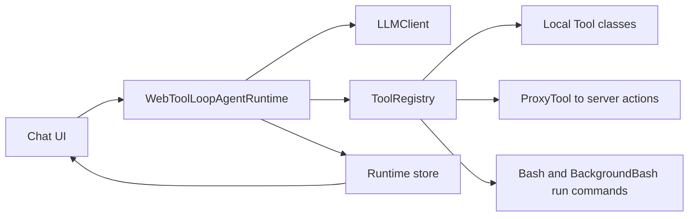

# hammer-ai

Infrastructure for building tool-calling chat agents in TypeScript.

This package gives you:
- OpenAI-compatible LLM client with streaming support
- Agent loop runtime for web/chat interfaces
- Tool base class and tool registry
- Built-in handling for tool, bash, and background_bash run targets
- Memory and validation layers for longer multi-step workflows

The examples below are based on a real production-style integration from monoslides.

## Install

```bash
bun add hammer-ai
```

## Mental model



## 1. Configure providers (Qwen and DeepSeek)

Configure once at startup. You can keep multiple named presets and choose one for your runtime.

```ts
import { configure } from "hammer-ai"

configure({
  providers: {
    "qwen-plus": {
      apiKey: process.env.DASHSCOPE_API_KEY!,
      baseUrl: "https://dashscope.aliyuncs.com/compatible-mode/v1",
      model: "qwen-plus",
      enableThinking: false,
    },
    deepseek: {
      apiKey: process.env.DEEPSEEK_API_KEY!,
      baseUrl: "https://api.deepseek.com",
      model: "deepseek-v4-flash",
      enableThinking: false,
    },
    "deepseek-reasoner": {
      apiKey: process.env.DEEPSEEK_API_KEY!,
      baseUrl: "https://api.deepseek.com",
      model: "deepseek-reasoner",
      enableThinking: true,
    },
  },
  compactionProvider: "deepseek",
})
```

Notes:
- For Qwen-style endpoints, enableThinking maps to enable_thinking.
- For DeepSeek endpoints, enableThinking maps to thinking.type (enabled or disabled).

## 2. Create tools

Create local tools by extending Tool.

```ts
import { Tool, type ToolResult, type ToolSchema } from "hammer-ai"

export class GetSlideFilePath extends Tool {
  override getName(): string {
    return "GetSlideFilePath"
  }

  override getDescription(): string {
    return "Return the absolute path for the active slide SVG"
  }

  override getSchema(): ToolSchema {
    return {
      slideId: {
        type: "string",
        required: true,
        positional: false,
        description: "Slide identifier",
      },
    }
  }

  override async execute(params: Record<string, any>): Promise<ToolResult> {
    const slideId = String(params.slideId ?? "").trim()
    if (!slideId) return { success: false, error: "slideId is required" }

    return {
      success: true,
      path: `/workspace/slide-${slideId}.svg`,
    }
  }
}
```

## 3. Wire registry + proxy tools + bash

Use createToolRegistry for a mixed tool surface:
- local tool classes
- proxy tools that call server actions
- bash run command bindings

```ts
import {
  createToolRegistry,
  ProxyTool,
  createRunCommandRuntimeBindings,
  BackgroundBashRunCommand,
} from "hammer-ai"
import { BashRunCommand } from "hammer-ai"

import { GetSlideFilePath } from "./tools/GetSlideFilePath"
import { CreateOrReplaceSlide } from "./tools/CreateOrReplaceSlide"
import { executeWebToolAction } from "./actions/web-tool-actions"

class AppBashRunCommand extends BashRunCommand {
  protected override async executeCommand(command: string) {
    // Route shell execution to your sandbox/session implementation.
    return executeInSandbox(command)
  }
}

const registry = createToolRegistry(
  [
    new ProxyTool(
      {
        name: "BraveWebSearch",
        description: "Search the web",
        parameters: {
          query: {
            type: "string",
            description: "Search query",
            required: true,
          },
        },
      },
      (parameters) => executeWebToolAction({ tool: "BraveWebSearch", input: parameters }),
    ),
    new GetSlideFilePath(),
    new CreateOrReplaceSlide(),
  ],
  createRunCommandRuntimeBindings(
    new AppBashRunCommand(),
    new BackgroundBashRunCommand(),
  ),
)

const executeTool = registry.createExecutor()
```

## 4. Build a chat runtime

WebToolLoopAgentRuntime is the easiest way to run a multi-step tool loop and stream content into UI state.

```ts
import {
  createRuntimeStore,
  createInitialWebAgentState,
  WebToolLoopAgentRuntime,
  LLMClient,
  getProviderConfig,
  buildAgentIdentityLine,
  buildWebRuntimeRules,
} from "hammer-ai"

const runtimeStore = createRuntimeStore(() => createInitialWebAgentState())

class SlidesRuntime extends WebToolLoopAgentRuntime {
  constructor() {
    super({
      store: runtimeStore,
      messageIdPrefix: "slides-msg",
      llmClient: new LLMClient({
        ...getProviderConfig("deepseek"),
        enableThinking: false,
      }),
      getToolDefinitions: () => registry.getToolDefinitions(),
      executeTool,
      memoryPreset: "monoslides",
      systemIdentity: buildAgentIdentityLine({
        agentName: "MonoSlides",
        roleDescription: "Slide design assistant",
      }),
      extraRules: buildWebRuntimeRules({
        includeVerifiedCompletionRule: true,
      }),
      temperature: 0.2,
      maxTokens: 8192,
      allowedRunTargets: ["tool", "bash"],
    })
  }

  async run(userTask: string): Promise<void> {
    await this.executeDefaultWebRun(userTask, {
      shouldSurfaceAssistantContent: (_reasoning, rawContent) => Boolean(rawContent),
    })
  }

  abort(): void {
    this.defaultWebAbort()
  }

  reset(): void {
    this.defaultWebReset()
  }
}

export const runtime = new SlidesRuntime()
```

## 5. Expose controller actions

A small controller wrapper keeps runtime actions and store in one object.

```ts
import { defineRuntimeController } from "hammer-ai"

export const chatController = defineRuntimeController({
  store: runtimeStore,
  actions: {
    run: (prompt: string) => runtime.run(prompt),
    abort: () => runtime.abort(),
    reset: () => runtime.reset(),
  },
  refs: {} as const,
})
```

## 6. Render in UI

You can subscribe directly with useSyncExternalStore.

```tsx
import { useSyncExternalStore, useState } from "react"

function useRuntimeState() {
  return useSyncExternalStore(
    chatController.store.subscribe,
    chatController.store.getSnapshot,
    chatController.store.getServerSnapshot,
  )
}

export function ChatPanel() {
  const state = useRuntimeState()
  const [input, setInput] = useState("")
  const isRunning = state.phase === "thinking" || state.phase === "tool-calling"

  return (
    <div>
      <div>
        {state.messages.map((message) => (
          <div key={message.id}>{message.content}</div>
        ))}
        {state.streamingContent ? <div>{state.streamingContent}</div> : null}
      </div>

      <form
        onSubmit={(event) => {
          event.preventDefault()
          const next = input.trim()
          if (!next || isRunning) return
          chatController.actions.run(next)
          setInput("")
        }}
      >
        <textarea value={input} onChange={(event) => setInput(event.target.value)} />
        {isRunning ? (
          <button type="button" onClick={() => chatController.actions.abort()}>Stop</button>
        ) : (
          <button type="submit">Send</button>
        )}
      </form>
    </div>
  )
}
```

## 7. Recommended production patterns

- Keep local, deterministic operations as Tool subclasses.
- Wrap privileged/server-only capabilities (web calls, secrets, DB) with ProxyTool.
- Give the model only the run targets you want via allowedRunTargets.
- Keep strict completion rules (for example: todo list must be completed before exit).
- Use executeDefaultWebRun for serialization, abort handling, and consistent state transitions.
- Prefer enableThinking: false for latency-sensitive UX, and enable it only for tasks that need deeper reasoning.

## 8. Minimal server action bridge example

```ts
import { createWebSearchToolActions } from "hammer-ai"

const actions = createWebSearchToolActions({
  executeWebSearch: (tool, input) => {
    if (tool === "BochaWebSearch") return bocha.execute(input)
    return brave.execute(input)
  },
})

export async function executeWebToolAction(input: {
  tool: "BraveWebSearch" | "BochaWebSearch"
  input: Record<string, unknown>
}) {
  return actions.executeWebTool(input)
}
```

## API Surface

Main exports used in this guide:
- configure, getProviderConfig
- LLMClient
- Tool, ProxyTool, SubAgentTool
- createToolRegistry, createRunCommandRuntimeBindings
- BashRunCommand, BackgroundBashRunCommand
- WebToolLoopAgentRuntime
- createRuntimeStore, defineRuntimeController
- createInitialWebAgentState
- createWebSearchToolActions
